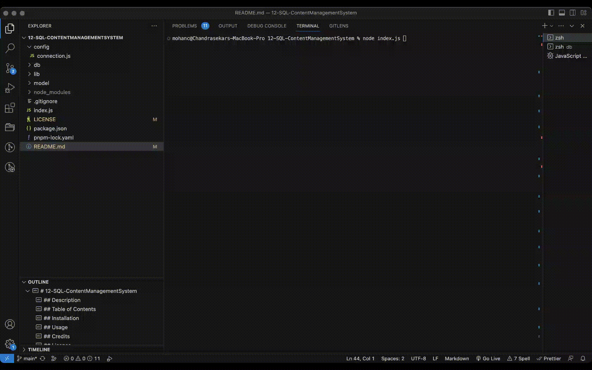

# 12-SQL-ContentManagementSystem

[](http://choosealicense.com/licenses/mit/)

## Description
A command-line application to manage a company's employee database built using Node.js, Inquirer, and MySQL.

## Table of Contents
 - [Installation](#installation)
 - [Usage](#usage)
 - [Credits](#credits)
 - [License](#license)
 - [Contributor](#contributor)
 - [Tests](#tests)

## Installation
Clone the github repo as shown below, <br/><br/> ``` git clone git@github.com:chandraucb/12-SQL-ContentManagementSystem.git ``` <br/><br/> Run node package install <br/><br/> ``` npm install ```

Execute schema.sql and seeds.sql in mysql instances and update db connection details within config/connection.js to point your database.

## Usage
To run this application execute below command and follow the prompts <br/><br/> ```node index.js ``` <br/> <br/>  

## Credits
https://github.com/SBoudrias/Inquirer.js/tree/master/packages/inquirer

## License
Copyright (c) 2023 Chandrasekar Mohan
Licensed under the MIT License


## Contributor
Code contributions are welcome! <br> To contributre, make a fork and clone of the project to your local repo to include your changes. <br> Once changes are ready, create a pull request to merge them to main branch. <br> Include CONTRIBUTOR.md to get the credits

## Tests
To test the app, run following unit test command 


 ``` npm install jest ```
``` npm run test ```


## Questions 
  Name : Chandrasekar Mohan 
  Git profile : https://github.com/chandraucb 
  Contact email : xyz@abc.com 
  Reach me through email with additional questions

